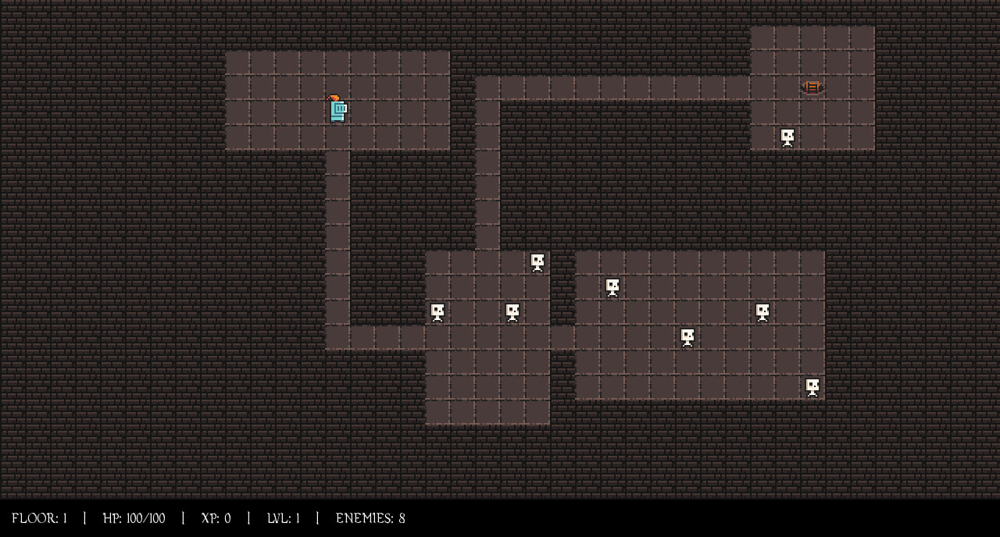

# DungeonRPG

A 2D roguelike RPG written in C++ using SFML and CMake.

> ⚠️ **Project Status:** Pre-Alpha. This project is actively developed as a learning and portfolio project. Features, architecture, and assets are subject to frequent changes and refactoring.



## Features

### Gameplay

* Procedurally generated dungeon floors.
* Random room and corridor generation.
* Multiple dungeon levels connected by exits.
* Player progression system (Level and Experience).
* Enemy spawning system.
* Basic melee combat.
* Floor progression.

### Graphics

* SFML-based 2D rendering.
* Animated player sprites (Idle / Run).
* Animated enemy sprites.
* Tile-based dungeon rendering using the 0x72 Dungeon Tileset.
* Real-time HUD displaying:

  * Current Floor
  * HP
  * Level
  * Experience

### Audio

* Background music support.
* Audio assets loaded from the `assets` directory.

<details>
  <summary>🎵 <b>Listen to the Soundtrack Demo</b> (Click to expand)</summary>
  <br>
  <video src="https://github.com/user-attachments/assets/5676f085-2bda-4307-b19f-fc1de0f3ebaa" controls width="100%"></video>
</details>

### Technical Features

* Modern C++ project structure.
* CMake build system.
* Cross-platform architecture.
* Separation of game logic and rendering systems.
* Expandable codebase prepared for future gameplay systems.

## Project Structure

```text
assets/         Game assets (textures, audio)
src/            Source files
include/        Header files
build/          Generated build files
```

## Controls

| | | |
| :---: | :---: | :---: |
| <kbd>Q</kbd> | <kbd>W</kbd> | <kbd>E</kbd> |
| <kbd>A</kbd> | 🕹️ | <kbd>D</kbd> |
| <kbd>Z</kbd> | <kbd>X</kbd> | <kbd>C</kbd> |

Movement is supported in 8 directions.

## Building

### Requirements

* C++17 compatible compiler
* CMake 3.15+
* SFML 3.x

### Build

```bash
cmake -B build
cmake --build build
```

### Run

```bash
./build/DungeonRPG
```

On Windows:

```bash
./build/DungeonRPG.exe
```

## Current Roadmap

### Short-Term

* Improved combat system
* Enemy AI
* Death and game over mechanics
* Inventory system
* Loot drops

### Mid-Term

* Equipment and item modifiers
* Character talents
* Additional enemy types
* Dungeon events and traps
* Save/Load system

### Long-Term

* Advanced procedural generation
* Animation system improvements
* Additional biomes and tilesets
* ECS research and possible migration
* Larger standalone RPG project based on the current prototype

```
```
